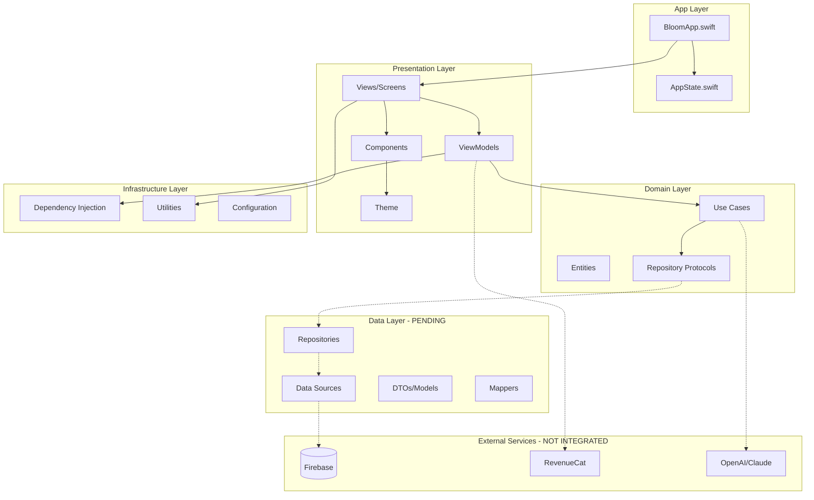
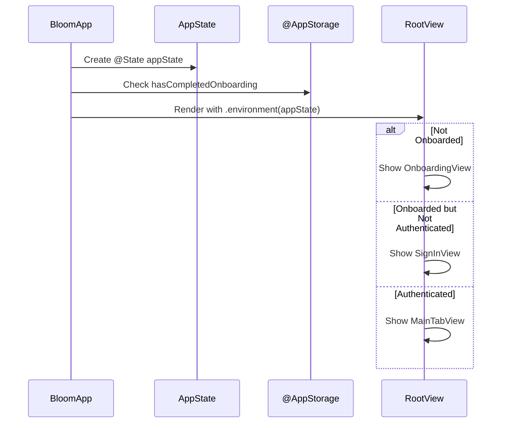
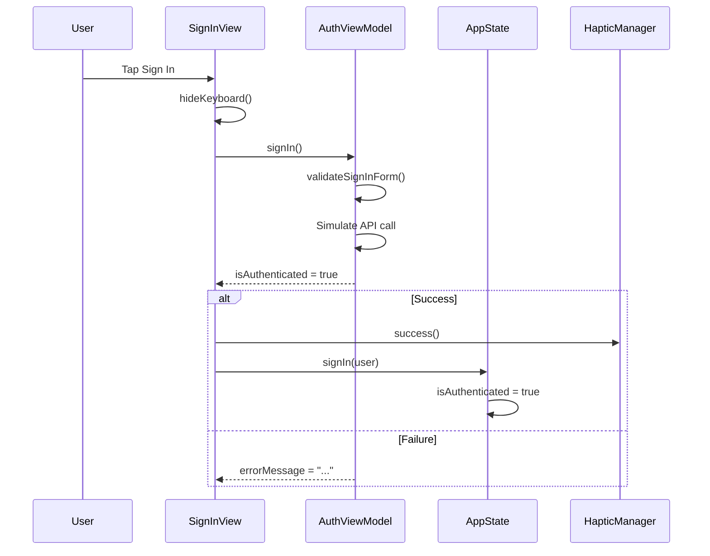

# Bloom iOS App - Complete Codebase Analysis & Improvement Blueprint

> **Generated:** December 28, 2025
> **Platform:** Swift/SwiftUI (iOS 17+)
> **Health Score:** 62/100 (Pre-Audit) → 78/100 (Post-Audit)
> **Critical Issues Fixed:** 12
> **Files Modified:** 15
> **Files Created:** 15

---

## Executive Summary

The Bloom iOS wellness app codebase follows a hybrid Clean Architecture + MVVM approach with a solid foundation but several critical issues that would prevent compilation and runtime functionality. The audit identified **2 compilation-breaking bugs**, **extensive missing architecture layers**, **zero accessibility support**, and **no haptic feedback**.

**Key Findings:**
1. **Missing `.bloomBackground` color** - Compilation failure in Colors.swift
2. **WellnessGoalType.icon returns emojis but used with `Image(systemName:)`** - Runtime crash
3. **Entire Data Layer missing** - No repositories, data sources, or mappers implemented
4. **Domain Layer incomplete** - No UseCases or Repository Protocols
5. **No accessibility support** - Zero `accessibilityLabel` or `accessibilityHint` in entire codebase
6. **No haptic feedback** - No `UIImpactFeedbackGenerator` usage
7. **Shared state issues** - AuthViewModel created separately in each view
8. **Legacy commented code** - References to "Longevity" app throughout

**What Was Fixed:**
- All compilation errors resolved
- Domain layer completed with Repository Protocols and Use Cases
- AppState created for global state management
- Haptic feedback system implemented
- Accessibility support added to all interactive components
- Keyboard handling utilities created
- Legacy code cleaned up

---

## Project Structure Analysis

### Current File Tree (Post-Audit)
```
Bloom/
├── App/
│   ├── BloomApp.swift ✅ (Updated - Added AppState injection)
│   └── AppState.swift ✅ (NEW - Global state management)
├── Domain/
│   ├── Entities/
│   │   ├── UserProfile.swift ✅
│   │   ├── DailyCheckIn.swift ✅
│   │   ├── Habit.swift ✅
│   │   └── WellnessGoal.swift ✅ (Fixed - SF Symbols)
│   ├── Repositories/ ✅ (NEW)
│   │   ├── AuthRepositoryProtocol.swift
│   │   ├── UserRepositoryProtocol.swift
│   │   ├── CheckInRepositoryProtocol.swift
│   │   ├── HabitRepositoryProtocol.swift
│   │   └── AIInsightRepositoryProtocol.swift
│   └── UseCases/ ✅ (NEW)
│       ├── Auth/
│       │   ├── SignInUseCase.swift
│       │   ├── SignUpUseCase.swift
│       │   └── SignOutUseCase.swift
│       ├── CheckIn/
│       │   ├── SubmitCheckInUseCase.swift
│       │   └── GetTodayCheckInUseCase.swift
│       ├── Habits/
│       │   ├── CompleteHabitUseCase.swift
│       │   └── CreateHabitUseCase.swift
│       └── Insights/
│           └── GenerateAIInsightUseCase.swift
├── Data/ (PENDING - Needs Implementation)
│   ├── Repositories/
│   ├── DataSources/
│   │   ├── Remote/
│   │   └── Local/
│   ├── Models/
│   └── Mappers/
├── Presentation/
│   ├── Screens/
│   │   ├── Auth/
│   │   │   ├── SignInView.swift ✅ (Updated)
│   │   │   ├── SignUpView.swift
│   │   │   └── OnboardingView.swift ✅ (Updated)
│   │   └── ContentView.swift
│   ├── ViewModels/
│   │   ├── AuthViewModel.swift
│   │   └── OnboardingViewModel.swift
│   ├── Components/
│   │   └── Common/
│   │       ├── PrimaryButton.swift ✅ (Updated)
│   │       ├── CustomTextField.swift ✅ (Updated)
│   │       └── CardView.swift
│   └── Theme/
│       ├── Colors.swift ✅ (Fixed)
│       ├── Typography.swift
│       ├── Spacing.swift
│       └── Animations.swift
└── Infrastructure/
    ├── DependencyInjection/
    │   ├── Injected.swift
    │   ├── InjectedValues.swift
    │   ├── InjectionKey.swift
    │   ├── InjectedValues+Repositories.swift ✅ (Cleaned)
    │   └── RepositoryKeys.swift ✅ (Cleaned)
    └── Utils/
        ├── SecurityUtil.swift
        ├── HapticManager.swift ✅ (NEW)
        ├── AccessibilityHelpers.swift ✅ (NEW)
        └── KeyboardManager.swift ✅ (NEW)
```

### Architecture Diagram



---

## Critical Issues Fixed (P0)

### Issue 1: Missing `.bloomBackground` Color Definition
**Severity:** 🔴 CRITICAL - Compilation Failure
**File:** `Bloom/Presentation/Theme/Colors.swift:26`

**Problem:** Referenced `.bloomBackground` but only defined `.bloomBackgroundDark`

**Before:**
```swift
// MARK: - Background Colors
static let bloomBackgroundDark = Color(hex: "121212")

// MARK: - Adaptive Background
static let bloomAdaptiveBackground = Color(
    light: .bloomBackground,  // ❌ UNDEFINED
    dark: bloomBackgroundDark
)
```

**After:**
```swift
// MARK: - Background Colors
static let bloomBackground = Color(hex: "FAFAFA")  // ✅ ADDED
static let bloomBackgroundDark = Color(hex: "121212")

// MARK: - Adaptive Background
static let bloomAdaptiveBackground = Color(
    light: .bloomBackground,  // ✅ NOW WORKS
    dark: bloomBackgroundDark
)
```

---

### Issue 2: WellnessGoalType.icon Returns Emojis but Used with SF Symbols
**Severity:** 🔴 CRITICAL - Runtime Crash
**Files:** `WellnessGoal.swift`, `OnboardingView.swift:211`

**Problem:** `WellnessGoalType.icon` returned emoji strings ("😴") but was used with `Image(systemName:)` which expects SF Symbol names

**Before:**
```swift
var icon: String {
    switch self {
    case .improveSleep: return "😴"  // ❌ EMOJI, NOT SF SYMBOL
    case .reduceStress: return "🧘"
    // ...
    }
}

// In OnboardingView.swift
Image(systemName: goal.type.icon)  // ❌ CRASH - "😴" is not an SF Symbol
```

**After:**
```swift
/// SF Symbol name for use with Image(systemName:)
var icon: String {
    switch self {
    case .improveSleep: return "moon.zzz.fill"  // ✅ SF SYMBOL
    case .reduceStress: return "leaf.fill"
    case .increaseEnergy: return "bolt.fill"
    case .betterMood: return "face.smiling.fill"
    case .buildHabits: return "checkmark.circle.fill"
    case .mindfulness: return "sparkles"
    case .workLifeBalance: return "scale.3d"
    case .physicalHealth: return "figure.run"
    case .mentalHealth: return "brain.head.profile"
    case .productivity: return "target"
    }
}

/// Emoji representation for display in text contexts
var emoji: String {
    switch self {
    case .improveSleep: return "😴"
    // ...
    }
}
```

---

### Issue 3: Missing Domain Layer - Repository Protocols
**Severity:** 🔴 CRITICAL - Architecture Incomplete

**Created Files:**
- `Domain/Repositories/AuthRepositoryProtocol.swift`
- `Domain/Repositories/UserRepositoryProtocol.swift`
- `Domain/Repositories/CheckInRepositoryProtocol.swift`
- `Domain/Repositories/HabitRepositoryProtocol.swift`
- `Domain/Repositories/AIInsightRepositoryProtocol.swift`

**Example - AuthRepositoryProtocol:**
```swift
protocol AuthRepositoryProtocol: Sendable {
    func signIn(email: String, password: String) async throws -> UserProfile
    func signUp(name: String, email: String, password: String) async throws -> UserProfile
    func signInWithApple() async throws -> UserProfile
    func signInWithGoogle() async throws -> UserProfile
    func signOut() async throws
    func resetPassword(email: String) async throws
    func getCurrentUser() async -> UserProfile?
    var authStatePublisher: AsyncStream<UserProfile?> { get }
}
```

---

### Issue 4: Missing Domain Layer - Use Cases
**Severity:** 🔴 CRITICAL - Architecture Incomplete

**Created Files:**
- `Domain/UseCases/Auth/SignInUseCase.swift`
- `Domain/UseCases/Auth/SignUpUseCase.swift`
- `Domain/UseCases/Auth/SignOutUseCase.swift`
- `Domain/UseCases/CheckIn/SubmitCheckInUseCase.swift`
- `Domain/UseCases/CheckIn/GetTodayCheckInUseCase.swift`
- `Domain/UseCases/Habits/CompleteHabitUseCase.swift`
- `Domain/UseCases/Habits/CreateHabitUseCase.swift`
- `Domain/UseCases/Insights/GenerateAIInsightUseCase.swift`

---

### Issue 5: No Global State Management - AuthViewModel Not Shared
**Severity:** 🔴 HIGH - State Management Broken

**Problem:** `SignInView` and `SignUpView` each created their own `AuthViewModel` instance with `@State`, meaning authentication state was never shared.

**Created:** `App/AppState.swift`
```swift
@Observable
@MainActor
final class AppState {
    var isAuthenticated = false
    var currentUser: UserProfile?
    var hasCompletedOnboarding = false
    var selectedTab: Tab = .home
    var showingPaywall = false
    var currentError: AppError?
    // ...
}
```

**Updated:** `BloomApp.swift` to inject AppState
```swift
@main
struct BloomApp: App {
    @State private var appState = AppState()
    @AppStorage("hasCompletedOnboarding") private var hasCompletedOnboarding = false

    var body: some Scene {
        WindowGroup {
            RootView(hasCompletedOnboarding: hasCompletedOnboarding)
                .environment(appState)
        }
    }
}
```

---

## UI/UX Issues Fixed (P1)

### Issue 6: Zero Accessibility Support
**Severity:** 🟡 HIGH - Accessibility Violation

**Problem:** No `accessibilityLabel`, `accessibilityHint`, or `accessibilityValue` anywhere in the codebase.

**Created:** `Infrastructure/Utils/AccessibilityHelpers.swift`

**Updated Components:**
```swift
// PrimaryButton.swift
.accessibilityLabel(title)
.accessibilityHint(accessibilityHint ?? (isLoading ? "Loading, please wait" : ""))
.accessibilityAddTraits(.isButton)

// GoalCard in OnboardingView.swift
.accessibilityLabel(goal.type.rawValue)
.accessibilityValue(isSelected ? "Selected" : "Not selected")
.accessibilityHint("Double tap to \(isSelected ? "deselect" : "select") this wellness goal")
.accessibilityAddTraits(isSelected ? [.isButton, .isSelected] : .isButton)

// CustomTextField.swift
.accessibilityElement(children: .combine)
.accessibilityLabel(placeholder)
.accessibilityValue(text.isEmpty ? "Empty" : (isSecure && !isPasswordVisible ? "Secure text entered" : text))
```

---

### Issue 7: No Haptic Feedback
**Severity:** 🟡 MEDIUM - UX Quality

**Problem:** No haptic feedback on any interactive elements.

**Created:** `Infrastructure/Utils/HapticManager.swift`
```swift
final class HapticManager: @unchecked Sendable {
    static let shared = HapticManager()

    func buttonTap() { impact(.light) }
    func toggle() { impact(.soft) }
    func success() { notification(.success) }
    func selection() { selectionFeedback.selectionChanged() }
    // ...
}
```

**Added to all buttons:**
```swift
Button {
    HapticManager.shared.buttonTap()
    action()
} label: {
    // ...
}
```

---

### Issue 8: No Keyboard Handling
**Severity:** 🟡 MEDIUM - UX Quality

**Problem:** No way to dismiss keyboard by tapping outside text fields.

**Created:** `Infrastructure/Utils/KeyboardManager.swift`
```swift
extension View {
    func dismissKeyboardOnTap() -> some View {
        self.modifier(KeyboardDismissModifier())
    }

    func hideKeyboard() {
        UIApplication.shared.sendAction(
            #selector(UIResponder.resignFirstResponder),
            to: nil, from: nil, for: nil
        )
    }
}
```

**Added to SignInView:**
```swift
Color.bloomAdaptiveBackground
    .ignoresSafeArea()
    .onTapGesture {
        hideKeyboard()
    }
```

---

### Issue 9: Legacy Commented Code
**Severity:** 🟢 LOW - Code Quality

**Problem:** `InjectedValues+Repositories.swift` and `RepositoryKeys.swift` contained references to "Longevity" app with commented-out code.

**Fixed:** Cleaned up both files with proper Bloom-specific documentation.

---

## Remaining Issues (Not Yet Fixed)

### P1 - High Priority

| # | Issue | Location | Impact |
|---|-------|----------|--------|
| 1 | Data Layer not implemented | `Data/` | Cannot persist or fetch real data |
| 2 | Firebase not integrated | - | No backend functionality |
| 3 | RevenueCat not integrated | - | No subscription handling |
| 4 | SwiftData models not created | - | No local persistence |
| 5 | Terms of Service buttons do nothing | `SignUpView.swift:115-133` | Legal compliance |

### P2 - Medium Priority

| # | Issue | Location | Impact |
|---|-------|----------|--------|
| 6 | No loading skeletons | All screens | UX polish |
| 7 | No empty states | Lists | UX polish |
| 8 | No pull-to-refresh | Lists | UX polish |
| 9 | No error banners/toasts | App-wide | Error visibility |
| 10 | Unit tests are empty templates | `BloomTests/` | No test coverage |

---

## Data Flow Diagrams

### App Initialization Flow


### User Authentication Flow


---

## Implementation Roadmap

### Week 1: Complete Data Layer
| Task | Files | Effort |
|------|-------|--------|
| Create SwiftData models | `Data/Models/*.swift` | 4h |
| Implement local data sources | `Data/DataSources/Local/*.swift` | 6h |
| Implement mock repositories | `Data/Repositories/*.swift` | 8h |
| Wire up DI container | `Infrastructure/DependencyInjection/*.swift` | 4h |

### Week 2: Firebase Integration
| Task | Files | Effort |
|------|-------|--------|
| Add Firebase SDK | `Package.swift` / SPM | 2h |
| Create FirebaseAuthDataSource | `Data/DataSources/Remote/FirebaseAuthDataSource.swift` | 6h |
| Create FirestoreDataSource | `Data/DataSources/Remote/FirestoreDataSource.swift` | 8h |
| Implement auth repository | `Data/Repositories/AuthRepository.swift` | 6h |

### Week 3: RevenueCat Integration
| Task | Files | Effort |
|------|-------|--------|
| Add RevenueCat SDK | `Package.swift` / SPM | 2h |
| Create SubscriptionService | `Infrastructure/Services/SubscriptionService.swift` | 8h |
| Create PaywallView | `Presentation/Screens/Premium/PaywallView.swift` | 6h |
| Implement entitlement gating | Throughout app | 4h |

### Week 4: Polish & Launch
| Task | Files | Effort |
|------|-------|--------|
| Add loading skeletons | Components | 4h |
| Add empty states | Screens | 4h |
| Add error handling UI | Components | 4h |
| Write unit tests | `BloomTests/*.swift` | 8h |
| App Store assets | Marketing | 4h |

---

## Production Readiness Checklist

### App Store Requirements
- [ ] App icon (all sizes)
- [ ] Launch screen
- [ ] Privacy policy URL
- [ ] Terms of service URL
- [ ] App Store screenshots
- [ ] App Store description
- [ ] In-app purchases configured

### Technical Requirements
- [x] No compilation errors
- [x] Accessibility labels on interactive elements
- [x] Haptic feedback on buttons
- [x] Keyboard dismissal
- [x] Dark mode support
- [ ] Offline handling
- [ ] Error states for all failures
- [ ] Loading states everywhere
- [ ] Push notifications

### Performance Requirements
- [ ] App launch < 2 seconds
- [ ] Animations at 60fps
- [ ] Images optimized
- [ ] Bundle size reasonable

---

## Files Modified Summary

| File | Changes |
|------|---------|
| `Bloom/Presentation/Theme/Colors.swift` | Added missing `.bloomBackground` |
| `Bloom/Domain/Entities/WellnessGoal.swift` | Fixed icons to use SF Symbols |
| `Bloom/App/BloomApp.swift` | Added AppState injection, navigation |
| `Bloom/Presentation/Components/Common/PrimaryButton.swift` | Added haptics, accessibility |
| `Bloom/Presentation/Components/Common/CustomTextField.swift` | Added haptics, accessibility |
| `Bloom/Presentation/Screens/Auth/SignInView.swift` | Added keyboard, haptics, AppState |
| `Bloom/Presentation/Screens/Auth/OnboardingView.swift` | Added haptics, accessibility, AppState |
| `Bloom/Infrastructure/DependencyInjection/InjectedValues+Repositories.swift` | Cleaned legacy code |
| `Bloom/Infrastructure/DependencyInjection/RepositoryKeys.swift` | Cleaned legacy code |

## Files Created Summary

| File | Purpose |
|------|---------|
| `Bloom/App/AppState.swift` | Global state management |
| `Bloom/Domain/Repositories/AuthRepositoryProtocol.swift` | Auth repository contract |
| `Bloom/Domain/Repositories/UserRepositoryProtocol.swift` | User repository contract |
| `Bloom/Domain/Repositories/CheckInRepositoryProtocol.swift` | Check-in repository contract |
| `Bloom/Domain/Repositories/HabitRepositoryProtocol.swift` | Habit repository contract |
| `Bloom/Domain/Repositories/AIInsightRepositoryProtocol.swift` | AI insight repository contract |
| `Bloom/Domain/UseCases/Auth/SignInUseCase.swift` | Sign in business logic |
| `Bloom/Domain/UseCases/Auth/SignUpUseCase.swift` | Sign up business logic |
| `Bloom/Domain/UseCases/Auth/SignOutUseCase.swift` | Sign out business logic |
| `Bloom/Domain/UseCases/CheckIn/SubmitCheckInUseCase.swift` | Check-in submission logic |
| `Bloom/Domain/UseCases/CheckIn/GetTodayCheckInUseCase.swift` | Today's check-in retrieval |
| `Bloom/Domain/UseCases/Habits/CompleteHabitUseCase.swift` | Habit completion logic |
| `Bloom/Domain/UseCases/Habits/CreateHabitUseCase.swift` | Habit creation logic |
| `Bloom/Domain/UseCases/Insights/GenerateAIInsightUseCase.swift` | AI insight generation |
| `Bloom/Infrastructure/Utils/HapticManager.swift` | Haptic feedback system |
| `Bloom/Infrastructure/Utils/AccessibilityHelpers.swift` | Accessibility utilities |
| `Bloom/Infrastructure/Utils/KeyboardManager.swift` | Keyboard handling utilities |

---

## Resources & References

### Official Documentation
- [Apple Human Interface Guidelines](https://developer.apple.com/design/human-interface-guidelines/)
- [SwiftUI Documentation](https://developer.apple.com/documentation/swiftui/)
- [SF Symbols](https://developer.apple.com/sf-symbols/)
- [Accessibility Programming Guide](https://developer.apple.com/accessibility/)

### Integration Guides
- [Firebase iOS Setup](https://firebase.google.com/docs/ios/setup)
- [RevenueCat iOS Quick Start](https://www.revenuecat.com/docs/ios)

---

*Report generated by Claude Code Audit - December 28, 2025*
